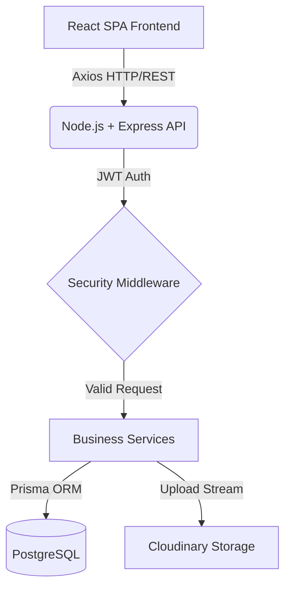

# medical-saas-showcase

<p align="left">
  <a href="https://react.dev/"></a>
  <a href="https://tailwindcss.com/"></a>
  <a href="https://axios-http.com/"></a>
  <a href="https://nodejs.org/"></a>
  <a href="https://expressjs.com/"></a>
  <a href="https://www.postgresql.org/"></a>
  <a href="https://www.prisma.io/"></a>
  <a href="https://jwt.io/"></a>
  <a href="https://github.com/kelektiv/node.bcrypt.js"></a>
  <a href="https://cloudinary.com/"></a>
  <a href="https://github.com/expressjs/multer"></a>
  <a href="https://jestjs.io/"></a>
  <a href="https://swagger.io/specification/"></a>
</p>

Professional showcase for a **commercial medical SaaS platform** focused on secure patient data management, clinical record workflows, and scalable API design.

## About The Project

### Business Context
Healthcare operations demand a system that is both **fast for clinicians** and **strictly secure for patient data**. This platform was designed to address a common bottleneck in medical organizations: fragmented records, delayed access to historical data, and operational overhead in handling attachments and consultation timelines.

### Solution Delivered
The HealthCare SaaS Platform centralizes patient and medical record operations in a single workflow-oriented product that emphasizes:

- **Operational efficiency** for day-to-day clinical teams.
- **Data integrity** through strict validation and domain constraints.
- **Security and compliance posture** aligned with LGPD/HIPAA principles.
- **Scalable architecture** ready for product growth and multi-user adoption.

### My Role
**Full Stack Developer & Solutions Architect**

- Defined architecture and backend service boundaries.
- Implemented secure authentication and authorization flows.
- Built core frontend modules for patient and record management.
- Structured quality gates (testing/documentation) for maintainability.

## Why A Showcase Repository?

This repository is intentionally a **showcase** and not the full production codebase.

Because the original platform is a commercial medical product handling sensitive patient data, the source remains private to preserve confidentiality and compliance commitments.

This public repository documents the **technical architecture, engineering decisions, and delivery standards** used in the project so technical recruiters and engineering leaders can evaluate implementation maturity without exposing protected assets.

## Architecture & Tech Stack

### High-Level Architecture



### Frontend Layer

| Category | Technologies | Responsibility |
| --- | --- | --- |
| UI Framework | React.js | Component-based user interface for clinical workflows |
| Styling | Tailwind CSS | Utility-first styling for rapid, consistent UI delivery |
| Icons | Lucide React | Lightweight, consistent iconography |
| Data Access | Axios | Typed HTTP integration with backend APIs |
| Navigation | React Router DOM | Route-level composition and guarded flows |

### Backend Layer

| Category | Technologies | Responsibility |
| --- | --- | --- |
| Runtime | Node.js | High-performance JavaScript runtime for API services |
| Framework | Express.js | Routing, middleware orchestration, HTTP lifecycle |
| Authentication | JWT + bcrypt.js | Token-based auth and password hashing |
| Upload Handling | Multer | Controlled multipart parsing and validation |
| API Documentation | Swagger/OpenAPI | Discoverable and contract-oriented API docs |

### Data & Cloud Layer

| Category | Technologies | Responsibility |
| --- | --- | --- |
| Database | PostgreSQL | Relational persistence with transactional reliability |
| ORM | Prisma | Type-safe queries, migrations, and schema evolution |
| File Storage | Cloudinary | Secure storage/access for medical record attachments |

## Technical Decisions & Best Practices

1. **Layered Architecture (MVC + Service Abstraction)**
Controllers are focused on request/response orchestration. Business rules are isolated in service layers. Persistence concerns are encapsulated through Prisma-based data access. This separation reduces coupling, improves testability, and supports safer refactoring.

2. **Security By Design**
Passwords are hashed with bcrypt.js. Stateless authentication is handled with JWT. Role-based access controls constrain sensitive operations. File upload paths enforce MIME/type and size validation. Error handling avoids leaking sensitive internals. The security model was designed to align with medical-data protection expectations.

3. **API Contract Validation**
Request payload validation is enforced before business execution. Domain constraints are checked at both API and persistence boundaries. Consistent response structures simplify frontend consumption and observability.

4. **Test-Driven Quality Mindset**
Core logic is covered by unit tests in Jest. Critical flows (auth, records, file handling) are tested against expected and edge-case scenarios.

## Key Features

- Secure role-based authentication with JWT and bcrypt.js.
- Complete CRUD for patients with strict input and domain validation.
- Complete CRUD for medical records with structured clinical information.
- Secure upload pipeline for exam and attachment files linked to records.
- Fluid user experience with real-time search and responsive navigation.
- Chronological consultation timeline for fast medical history review.

## Public Disclosure Boundaries (Security-First)

This showcase intentionally shares only artifacts that are safe for public review.

### Included In This Public Repository

- Sanitized architecture and engineering decisions.
- Redacted API examples and endpoint contracts.
- Isolated code snippets that do not reveal proprietary logic.

### Never Exposed Publicly

- UI screenshots or screen recordings (to protect proprietary UX workflows).
- Production credentials, secrets, tokens, or environment values.
- Real patient data or metadata that could enable re-identification.
- Internal infrastructure details (private hosts, bucket IDs, firewall rules).

## Live Demonstration (Upon Request)

To ensure absolute compliance with data privacy and to protect proprietary UI and UX workflows of this commercial product, no screenshots or screen recordings are publicly shared in this repository.

However, I am fully available to provide a live, guided demonstration of the application running locally during a technical interview. In this live demo (using strictly synthetic data), I can showcase:

- The role-aware login and access flow.
- Real-time patient search and medical timeline navigation.
- The exam attachment upload pipeline.
- The underlying codebase structure and database queries.

## API Documentation (Showcase-Safe)

The API is documented using Swagger/OpenAPI with a sanitized, recruiter-friendly contract.

Note: The full interactive Swagger UI is kept behind authentication in the production environment. A local instance of the OpenAPI documentation can be presented during the live technical demonstration.

### OpenAPI Example (Sanitized)

```yaml
paths:
  /patients:
    post:
      summary: Create a patient
      security:
        - bearerAuth: []
      requestBody:
        required: true
        content:
          application/json:
            schema:
              type: object
              required: [fullName, dateOfBirth, sex]
              properties:
                fullName:
                  type: string
                dateOfBirth:
                  type: string
                  format: date
                sex:
                  type: string
                  enum: [MALE, FEMALE, OTHER]
      responses:
        '201':
          description: Patient created
```

## Code Glimpses (Sanitized)

The snippets below are intentionally sanitized and simplified to demonstrate coding style, architecture organization, and security practices without exposing proprietary or sensitive data.

### 1. Prisma Domain Modeling (Example)

```prisma
model User {
  id           String   @id @default(uuid())
  email        String   @unique
  passwordHash String
  role         Role     @default(STAFF)
  createdAt    DateTime @default(now())
}

model Patient {
  id          String          @id @default(uuid())
  fullName    String
  dateOfBirth DateTime
  records     MedicalRecord[]
  createdAt   DateTime        @default(now())
  updatedAt   DateTime        @updatedAt
}

model MedicalRecord {
  id          String       @id @default(uuid())
  patientId   String
  chiefIssue  String
  assessment  String?
  createdById String
  createdAt   DateTime     @default(now())
  attachments Attachment[]

  patient Patient @relation(fields: [patientId], references: [id], onDelete: Cascade)
}
```

### 2. Controller-to-Service Pattern (Example)

```javascript
// controllers/patientController.js
import * as patientService from '../services/patientService.js';

export async function createPatient(req, res, next) {
  try {
    const payload = req.validatedBody;
    const actor = req.user;

    const patient = await patientService.createPatient(payload, actor);
    return res.status(201).json({ data: patient, message: 'Patient created successfully.' });
  } catch (error) {
    return next(error);
  }
}

// services/patientService.js
import prisma from '../lib/prisma.js';

export async function createPatient(payload, actor) {
  if (!['ADMIN', 'STAFF'].includes(actor.role)) {
    const err = new Error('Forbidden');
    err.statusCode = 403;
    throw err;
  }

  return prisma.patient.create({
    data: {
      fullName: payload.fullName.trim(),
      dateOfBirth: new Date(payload.dateOfBirth),
    },
    select: {
      id: true,
      fullName: true,
      createdAt: true,
    },
  });
}
```

## Project Snapshot

- Project: HealthCare SaaS Platform (Showcase)
- Repository: medical-saas-showcase
- Role: Full Stack Developer & Solutions Architect